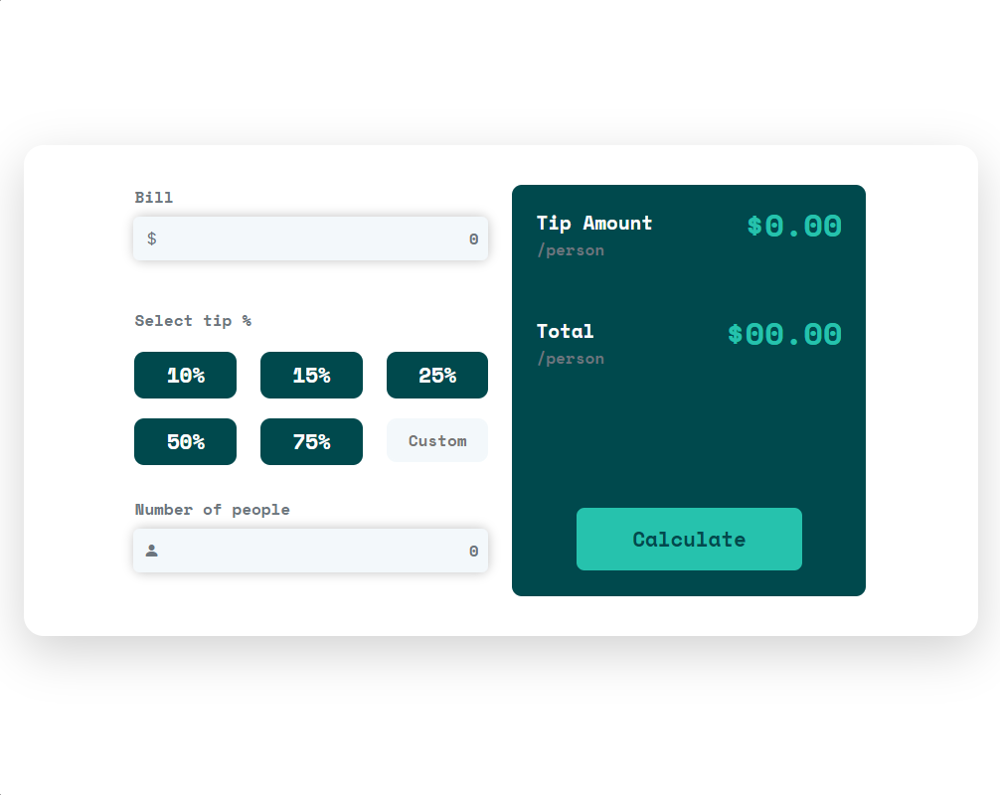

# Frontend Mentor - Tip calculator app solution

This is a solution to the [Tip calculator app challenge on Frontend Mentor](https://www.frontendmentor.io/challenges/tip-calculator-app-ugJNGbJUX). Frontend Mentor challenges help you improve your coding skills by building realistic projects.

I really appreciate Frontend Mentor

## Table of contents

- [Overview](#overview)
  - [The challenge](#the-challenge)
  - [Screenshot](#screenshot)
  - [Links](#links)
- [Built with](#built-with)
- [Author](#author)
- [Acknowledgments](#acknowledgments)

## Overview

Simple tip calculator that can help you calculate tip per person.

### Screenshot

### Links

- Live Site URL: [https://sirmerdas.github.io/tip-calculator/](https://sirmerdas.github.io/tip-calculator/)

## Built with

- Semantic HTML5 markup
- CSS custom properties
- Javascript
- Mobile-first workflow
- [Bootstrap](https://getbootstrap.com/) - Css framework
- [Bootstrap-icons](https://icons.getbootstrap.com/) - Amazing icons
- [Google fonts](https://fonts.google.com/) - Space mono font

## Author

- Website - [Sir Merdas](https://sirmerdas.ir/)
